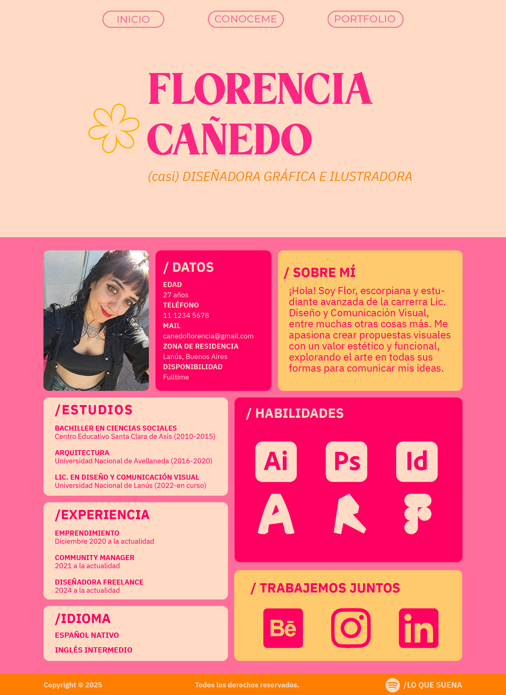

TP1 Estructura HTML5

En base a un boceto realizado en Illustrator con la dimensión del ancho de mi pantalla (1920 píxeles) se realizó el esqueleto en html (para tener noción de las medidas de las cajas y sus márgenes) aplicándo el diseño con estilos.css y, aplicando flexbox en las distintas cajas, se buscó darle dinamismo toda a la página. Se seccionó en 2 partes: la primera lo que sería un "inicio" con 3 links de navegación que simula la redireccion a otras paginas, y también mi nombre con una bajada.
Una vez hecho el scroll pasamos a la segunda sección dividida en columna izquierda y columna derecha. En la columna izquierda esta dividido en 3 cajas (estudios, experiencia e idiomas), y la columna derecha en una caja para habilidades y otra para lo que seria la parte de contacto.
Finalmente en la parte de footer se puso los legales y un link de redireccionamiento que te lleva a mi playlist predilecta al momento de diseñar o basicamente para existir.

Resolución de pantalla 1920 x 1080

